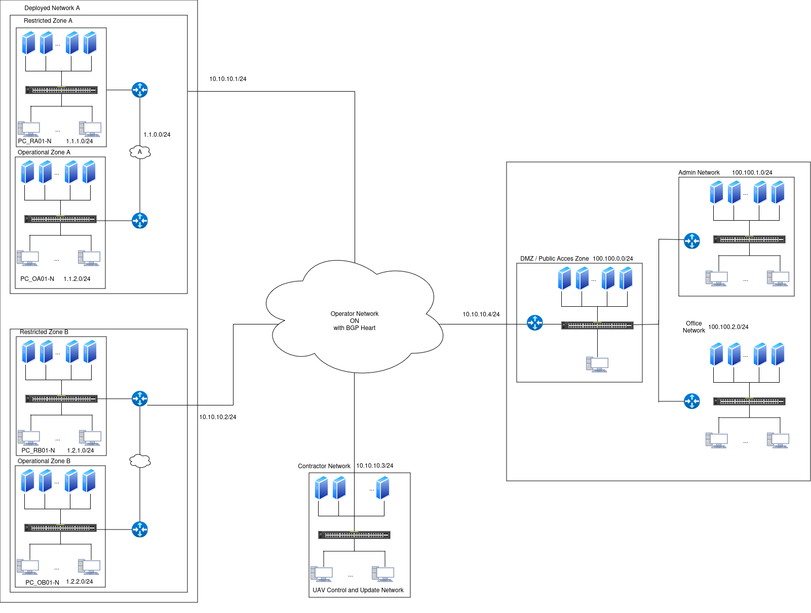

# Cage_scenario_w_Kathara
Scenario simulation used for cage challenge 4 with Kathara

# Install kathara
`sudo add-apt-repository ppa:katharaframework/kathara`

`sudo apt update`
## Manage Docker as a non-root user
`sudo add-apt-repository ppa:katharaframework/kathara`

`sudo groupadd docker`

`sudo usermod -aG docker $USER`

`newgrp docker`

## check install:
`kathara check`

# Scenario launch
`python3 simu.py`
