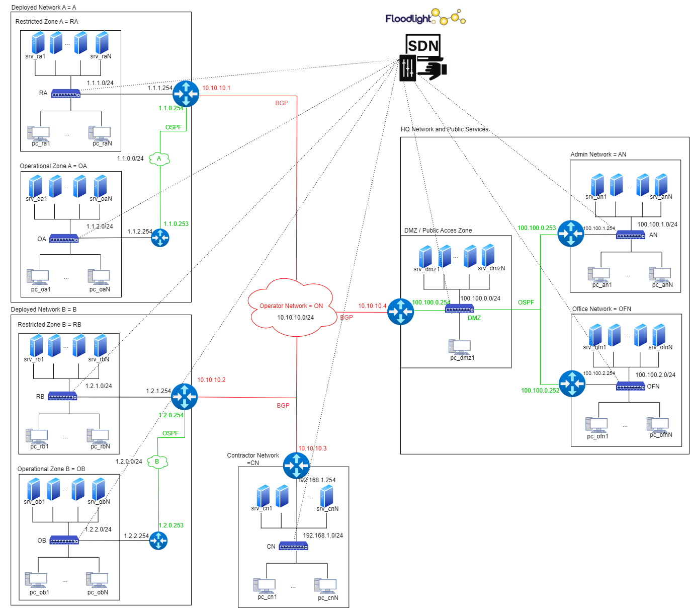

# BRETAGNE ( Building a Reproducible and Efficient Training AI Gym for Network Environments ) 
Scenario simulation used for cage challenge 4 with Kathara

# Install kathara
`sudo add-apt-repository ppa:katharaframework/kathara`

`sudo apt update`

`sudo apt install kathara`

## Manage Docker as a non-root user
`sudo add-apt-repository ppa:katharaframework/kathara`

`sudo groupadd docker`

`sudo usermod -aG docker $USER`

`newgrp docker`

### Debug Docker
If docker.errors.DockerException: Error while fetching server API version: ('Connection aborted.', FileNotFoundError(2, 'No such file or directory')) occurs.

`apt install docker.io`

In ~/.docker/config.json change credsStore to credStore.

## check install:
`kathara check`

# Install Python dependency
`sudo apt install python3-pip`

`pip3 install yaspin`

`python3 -m pip install git+https://github.com/saghul/pyuv@master#egg=pyuv`

`python3 -m pip install "kathara"`

`pip3 install poe-api-wrapper`

`pip3 install ballyregan`

# Download and install BRETAGNE
`git clone https://github.com/ThomasL53/BRETAGNE.git`

go to BRETAGNE directory
`cd BRETAGNE`

Source or add to bashrc the env.sh file
`source env.sh`

For more help
`bretagne -h`

# Using the blue agent
The blue agent used by BRETAGNE is based on the use of AWS bedrock with claude 3,5 Sonnet.
To use the Blue Agent, you need to configure your AWS login and password.

## Configure the AWS credentials
execute:

`aws configure`

# Using the blue agent with POE (not recommended) 
The blue agent used by BRETAGNE can also be used with POE with a special bot based on the use of GPT-4o-mini.
To use this agent, you need to create an account on POE (free).Then you have to get your private keys.

## How to get your Token

### Getting p-b and p-lat cookies
Sign in at https://poe.com/

F12 for Devtools (Right-click + Inspect)
- Chromium: Devtools > Application > Cookies > poe.com
- Firefox: Devtools > Storage > Cookies
- Safari: Devtools > Storage > Cookies

Copy the values of `p-b` and `p-lat` cookies and paste on BRETAGNE/BlueAgent.py

# Example of use

Starting a simulation with metasploit on the Operator Network (ON) and on the network Restricted Zone A (RA):

`bretagne --start --metasploit ON RA`

Open a terminal on pc_ra1:

`bretagne --control pc_ra1`

Observe traffic on the Operator Network (ON):

`bretagne --monitor ON`

Generating user traffic on the network:

`bretagne --generate_traffic 10`

Deploy a blue agent on the Operator Network (ON):

`bretagne --BlueAgent ON`

Stop the simulation:

`bretagne --stop`

